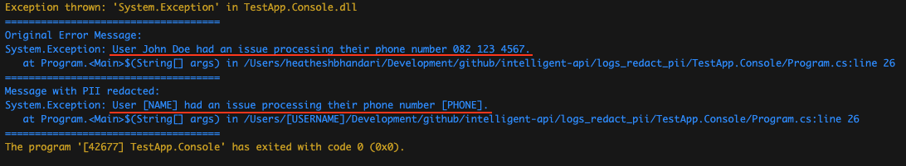
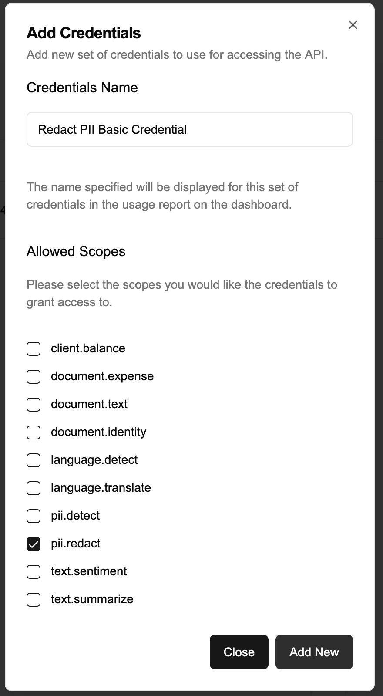

# Redact Personally Identifiable Information (PII) from logs



## Tools used

- .NET 9 https://dotnet.microsoft.com/en-us/download
- Intelligent API https://intelligent-api.com/

## Possible use cases

This sample code could be used in all applications where you would need to redact PII:

- Remove PII from comments
- Remove PII from reviews
- Remove PII from application logs

## Overview

This sample code shows how you could use the Intelligent API's Redact PII endpoint (https://docs.intelligent-api.com/api#pii-redact-personally-identifiable-information-pii-piiredact) using .NET to redact any personally identifiable information from log files.

We used .NET for this example however this could be achieved with any programming language using the Intelligent API.

## Getting started

This getting started guide shows you how to create your own version of this application. If you just want to use this code as is, please pull the repository and follow the guide as is but instead of copying the code where indicated you simply need to ensure you replace the relevant settings once you have setup your own versions of them (i.e. Intelligent API Credentials).

### Intelligent API

Follow the Intelligent API Getting Started guide https://docs.intelligent-api.com/docs/gettingstarted to create an account and then create a specific _*Basic Credential*_ with only the `pii.redact` scope specified.

> Be sure to store the `Client Id` and `Client Secret` securely, we will be adding that to the `appsettings.json` file later.



### .NET Project

Next we created a .NET project (we have .NET 9 SDK installed using the terminal) and added the relevant packages we needed to it:

```shell
dotnet new console --name TestApp.Console
cd TestApp.Console
dotnet add package Microsoft.Extensions.Configuration
dotnet add package Microsoft.Extensions.Configuration.Json
dotnet add package Microsoft.Extensions.Configuration.Binder
dotnet add package Microsoft.Extensions.DependencyInjection
```

Once the project is ready and the dependencies are installed, add an `appsettings.json` file with the `Client Id` and `Client Secret` updated accordingly:

```json
{
  "AppSettings": {
    "ClientId": "xxx",
    "ClientSecret": "xxx",
    "UserAgent": "TestApp.Console",
    "ApiEndpoint": "https://api.intelligent-api.com/v1/pii/redact"
  }
}
```

That was all for setup. If you are creating your own version of the app you just need to copy the relevant files from the folders into your project:

- Interface/\*
- Model/\*
- Service/\*

And be sure to copy the code from the `Program.cs` and update it how you see fit.

## Run the app

Once that is completed you can run the application, and see the test results:

```shell
dotnet run
```
